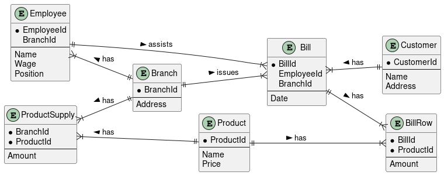

= Elektrohandel
Winnie Ilming, Luka Cvijić and Tobias Aichinger
:toc: left
:sectnums:
:toclevels: 3
:table-caption:
:linkattrs:
:sourcedir: ../sql
:experimental:

== Fachdomäne
In einer großen Firma die aus dem verkauf von elektronischen Geräten ihr geschäfft macht müssen die verschiedenen Filialen und deren Mitarbeiter sowie ihre Produkte und Verkäufe verwaltet werden.

* Employee(EmployeeId, BranchId, Name, Wage, Position)
* Branch(BranchId, Address)
* Bill(BillId, EmployeeId, BranchId, Date)
* Customer(CustomerId, Name, Address)
* BillRow(BillId, ProductId, Amount)
* Product(ProductId, Name, Price)
* ProductSupply(BranchId, ProductId, Amount)

=== DDL

[source,sql]
----
include::{sourcedir}/create-tables.sql[]
----

== Relevante Queries

=== SQL

* Auflistung der Anzalh der Produkte die in einer Filliale verkauft werden
* Auflistung des Umsatzes aller Fillialen
* Auflistung aller Mitarbeiter die an einem bestimmten Tag etwas verkauft haben
* Auflistung der meist verkauften 10 Produkte innerhalb einer Zeitspanne
* Auflistung aller Produkte die im letzten Monat nie verkauft worden sind
* Auflistung aller Kunden, die bei einem bestimmten Mitarbeiter etwas gekauft haben

=== Logging Trigger

* Beim Kauf werden Produkte, die es noch nicht gibt, neu erstellt
* Beim Verkauf werden Produkte, die nicht mehr im Lager sind, wird ein Fehler geloggt
* Beim Verkauf wird die Rechnung, die erstellt wird, geloggt

=== PL/SQL API zur Datenpflege

* Einkauf (Upsert)
* Verkauf (Rechnung druck)
* Anstellen von Mitarbeitern
* Entlassen von Mitarbeitern

== ERD
